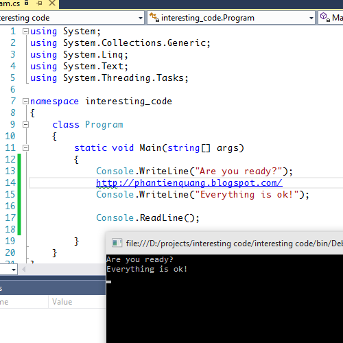
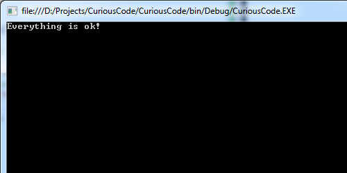

# Đoạn code thú vị

### Ví dụ

Hãy để ý dòng số 4 (dòng 14 hình dưới), và kết quả là:

Bạn đã bắt đầu thấy tò mò chưa? Tại sao có dòng số 4 mà đoạn code vẫn biên dịch và chạy như thường. Nếu xem xét kỹ thì sẽ hiểu ngay:

- http: đánh dấu 1 nhãn (label) trong c#, được dùng với lệnh goto.
- `//phantienquang.blogspot.com/` chắc hẳn là 1 đoạn comment vì nằm sau dấu `//`

### Giải thích

Để hiểu rõ hơn, mình thêm 1 dòng code như sau:

Tất nhiên, kết quả sẽ bị lược bỏ dòng 5 vì lệnh goto đã nhảy tới nhãn http:

